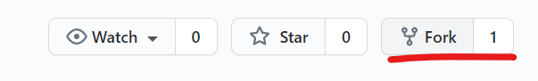

# Assignment 01

Project box to xy-plane:

* Create a box at a certain location with a certain orientation.
* Create a Projection (can be orthogonal, parallel or perspective)
* Convert the box to a mesh and project the it onto the xy-plane.
* Use artists to draw the result

## How to start

Use the following code as a starting point for your assignment:

```python
"""Assignment 01: Project box to xy-plane
"""
from compas.geometry import Box
from compas.geometry import Frame
from compas.geometry import Projection
from compas_rhino.artists import BoxArtist
from compas_rhino.artists import MeshArtist
from compas.datastructures import Mesh

# Define a Frame, which is not in the origin and a bit tilted to the world frame
# frame =

# Create a Box with that frame
# box = ...

# Create a Projection (can be orthogonal, parallel or perspective)
# P = Projection.from_...

# Create a Mesh from the Box
mesh = Mesh.from_shape(box)

# Apply the Projection onto the mesh
# mesh_projected = ...

# Create artists
artist1 = BoxArtist(box)
artist2 = MeshArtist(mesh_projected)

# Draw
artist1.draw()
artist2.draw_edges(color="#00ff00")

```

## Helpful links

* [Documentation of `Projection`](https://compas.dev/compas/latest/api/generated/compas.geometry.Projection.html?highlight=projection#compas.geometry.Projection)

## Expected result


## How to submit your assignment

1. Fork this repository

    

2. Add a new remote (<small>[What's a remote?](https://docs.github.com/en/github/using-git/about-remote-repositories)</small>)

        (compas-fs2021) cd path/to/COMPAS-II-FS2021
        (compas-fs2021) git remote add assignments https://github.com/REPLACE_THIS_WITH_YOUR_GITHUB_USERNAME/COMPAS-II-FS2021

3. Use a branch called `assignment-01` for this week's assignment

        (compas-fs2021) git checkout -b assignment-01
        (compas-fs2021) git push -u assignments assignment-01

4. Create a folder with your name and last name, eg. `elvis_presley` (make sure it is inside the current assignment folder)
5. Create a Python file (eg. `assignment_01.py`) and paste the starting point code.
6. Solve the coding assignment and commit
7. Once you're ready to submit, push the changes:

        git push assignments

8. And create a pull request (<small>[What's a pull request?](https://docs.github.com/en/github/collaborating-with-issues-and-pull-requests/about-pull-requests)</small>)

    1. Open your browser and go to your fork
    2. Create the pull request clicking `Compare & pull request` and follow the instructions

    
