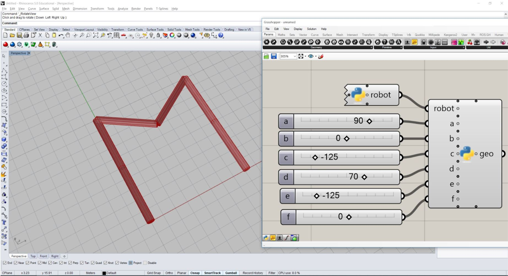

# Assignment 02

Build your own robot model.

* Build your own robot with a certain number n of links and n - 1 joints. 
* Create a Configuration with certain values and the correct joint types.
* Create a RobotModelArtist of your preference (e.g. compas_ghpython or compas_rhino)
* Use the artist to update the robot with the created configuration, such that it configures into the letter of your choice (or any other identifiable figure).


## How to start

Use the following code as a starting point for your assignment:

```python
"""Assignment 02: Build your own robot model
"""
from compas.geometry import Box
from compas.geometry import Frame
from compas.geometry import Projection
from compas_rhino.artists import BoxArtist
from compas_rhino.artists import MeshArtist
from compas.datastructures import Mesh

# Define a Frame, which is not in the origin and a bit tilted to the world frame
# frame =

# Create a Box with that frame
# box = ...

# Create a Projection (can be orthogonal, parallel or perspective)
# P = Projection.from_...

# Create a Mesh from the Box
mesh = Mesh.from_shape(box)

# Apply the Projection onto the mesh
# mesh_projected = ...

# Create artists
artist1 = BoxArtist(box)
artist2 = MeshArtist(mesh_projected)

# Draw
artist1.draw()
artist2.draw_edges(color="#00ff00")

```

## Helpful links

* [Documentation of `RobotModelArtist`](https://compas.dev/compas/latest/api/generated/compas.geometry.Projection.html?highlight=projection#compas.geometry.Projection)

## Expected result



## How to submit your assignment

1. Fork this repository

    

2. Make sure your local clone is up to date

       (compas-fs2021) git pull origin

3. Add a new remote (<small>[What's a remote?](https://docs.github.com/en/github/using-git/about-remote-repositories)</small>)

       (compas-fs2021) cd path/to/COMPAS-II-FS2021
       (compas-fs2021) git remote add assignments https://github.com/REPLACE_THIS_WITH_YOUR_GITHUB_USERNAME/COMPAS-II-FS2021

4. Use a branch called `assignment-02` for this week's assignment

       (compas-fs2021) git checkout -b assignment-02
       (compas-fs2021) git push -u assignments assignment-02

5. Create a folder with your name and last name, eg. `elvis_presley` (make sure it is inside the current assignment folder)
6. Create a Python file (eg. `assignment_02.py`) and paste the starting point code.
7. Solve the coding assignment and commit
    <details><summary><small>(How do I commit?)</small></summary>
    <p>

    Usually, commits are done from a visual client or VS code,
    but you can also commit your changes from the command line:

       (compas-fs2021) git add lecture_02/assignment_02/elvis_presley/\* && git commit -m "hello world"

    
    </p>
    </details>

8. Once you're ready to submit, push the changes:

       (compas-fs2021) git push assignments

9. And create a pull request (<small>[What's a pull request?](https://docs.github.com/en/github/collaborating-with-issues-and-pull-requests/about-pull-requests)</small>)

    1. Open your browser and go to your fork
    2. Create the pull request clicking `Compare & pull request` and follow the instructions

    
