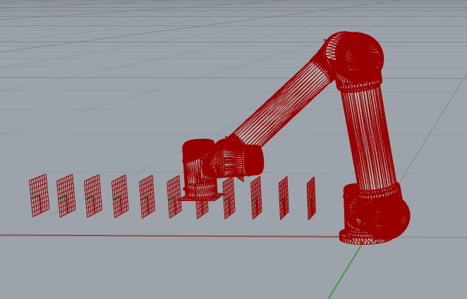

# Assignment 03

Using inverse kinematics

* Setup the MoveIt container for a UR5 on your laptop
* Use the RosClient to load the robot
* Take as input a list of brick positions as list of frames and use inverse_kinematics function to calculate viable configurations for each frame
* Store the results in a JSON file and commit the file in your submission

## How to start

Use the following code as a starting point for your assignment:

```python
"""Assignment 03: Using inverse kinematics
"""
import json
from compas_fab.backends import RosClient
from compas_fab.robots import Configuration

from compas.geometry import Frame
from compas.geometry import Point
from compas.geometry import Vector


# This function defines the inputs of your assignment, you get a compas_fab.robots.Robot and a Frame
# and are expected to return ONE valid configuration to reach that frame
def calculate_ik(robot, frame):
    # start_configuration = ...   # 1. define a valid start configuration for your frames
    # configuration = ...         # 2. use inverse kinematics to find out a valid configuration
    return configuration

def store_configurations(configurations):
    # 3. store all found configurations in a JSON file
    pass

# Use the following to test from the command line
# Or copy solution_viewer.ghx next to the folder where you created assignment_03.py to visualize the same in Grasshopper
if __name__ == '__main__':
    frame_list = [
        Frame(Point(0.084, 0.319, 0.175), Vector(0.000, 0.000, -1.000), Vector(0.000, 1.000, 0.000)),
        Frame(Point(0.152, 0.317, 0.175), Vector(0.000, 0.000, -1.000), Vector(0.000, 1.000, 0.000)),
        Frame(Point(0.220, 0.315, 0.175), Vector(0.000, 0.000, -1.000), Vector(0.000, 1.000, 0.000)),
        Frame(Point(0.288, 0.313, 0.175), Vector(0.000, 0.000, -1.000), Vector(0.000, 1.000, 0.000)),
        Frame(Point(0.357, 0.310, 0.175), Vector(0.000, 0.000, -1.000), Vector(0.000, 1.000, 0.000)),
        Frame(Point(0.425, 0.308, 0.175), Vector(0.000, 0.000, -1.000), Vector(0.000, 1.000, 0.000)),
        Frame(Point(0.493, 0.306, 0.175), Vector(0.000, 0.000, -1.000), Vector(0.000, 1.000, 0.000)),
        Frame(Point(0.561, 0.303, 0.175), Vector(0.000, 0.000, -1.000), Vector(0.000, 1.000, 0.000)),
        Frame(Point(0.629, 0.301, 0.175), Vector(0.000, 0.000, -1.000), Vector(0.000, 1.000, 0.000)),
        Frame(Point(0.698, 0.299, 0.175), Vector(0.000, 0.000, -1.000), Vector(0.000, 1.000, 0.000)),
        Frame(Point(0.766, 0.297, 0.175), Vector(0.000, 0.000, -1.000), Vector(0.000, 1.000, 0.000))
    ]

    # Loads the robot from ROS
    with RosClient('localhost') as client:
        robot = client.load_robot()

        # And call our assignment functions for each frame in the example
        configurations = []
        for frame in frame_list:
            configuration = calculate_ik(robot, frame)
            configurations.append(configuration)
            print("Found configuration", configuration)

        store_configurations(configurations)

```

## Expected result



## How to submit your assignment

1. You should have forked this repository last week, if not, check [assignment submission instructions in lecture 02](../../lecture_02/assignment_01#how-to-submit-your-assignment).
2. Make sure your local clone is up to date

       (compas-fs2021) git checkout main
       (compas-fs2021) git pull origin

3. Use a branch called `assignment-03` for this week's assignment

       (compas-fs2021) git checkout -b assignment-03
       (compas-fs2021) git push -u assignments assignment-03

4. Create a folder with your name and last name, eg. `elvis_presley` (make sure it is inside the current assignment folder)
5. Create a Python file named `assignment_03.py` and paste the starting point code.
6. For visual inspection, copy the file `solution_viewer.ghx` in the same folder of your `assignment_03.py`.
6. Solve the coding assignment and commit
    <details><summary><small>(How do I commit?)</small></summary>
    <p>

    Usually, commits are done from a visual client or VS code,
    but you can also commit your changes from the command line:

       (compas-fs2021) git add lecture_04/assignment_03/elvis_presley/\* && git commit -m "hello world"

    
    </p>
    </details>

8. Once you're ready to submit, push the changes:

       (compas-fs2021) git push assignments

9. And create a pull request (<small>[What's a pull request?](https://docs.github.com/en/github/collaborating-with-issues-and-pull-requests/about-pull-requests)</small>)

    1. Open your browser and go to your fork
    2. Create the pull request clicking `Compare & pull request` and follow the instructions

    
