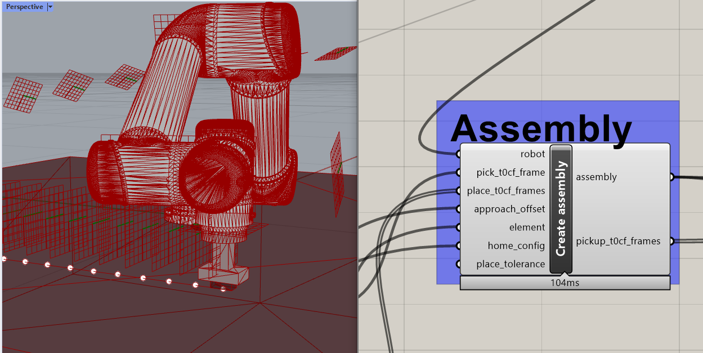

# Assignment 05

* Building up on the experience of the assignment 04, explore the updated process now based on the `Assembly` class (network-based)
* Using `07_pick_and_place_graph.ghx`, plan pickup trajectory and at least 8 elements
* Store the full assembly to a file called `assembly.json` using the provided serialization

## How to start

Use the example file `07_pick_and_place_graph.ghx` as starting point.

## Expected result

## How to submit your assignment

1. Make sure you have forked this repository already, if not, check [assignment submission instructions in lecture 02](../../lecture_02/assignment_01#how-to-submit-your-assignment).
2. Make sure your local clone is up to date on the `main` branch

       (compas-fs2021) git checkout main
       (compas-fs2021) git pull origin

3. Use a branch called `assignment-05` for this week's assignment

       (compas-fs2021) git checkout -b assignment-05
       (compas-fs2021) git push -u assignments assignment-05

4. Create a folder with your name and last name, eg. `elvis_presley` (make sure it is inside the current assignment folder)
5. After planning the trajectories move the `assembly.json` file generated into your folder.
6. Commit
    

<small>(How do I commit?)</small>

    

    Usually, commits are done from a visual client or VS code,
    but you can also commit your changes from the command line:

       (compas-fs2021) git add lecture_05/assignment_04/elvis_presley/\* && git commit -m "hello world"

    
    

    

8. Once you're ready to submit, push the changes:

       (compas-fs2021) git push assignments

9. And create a pull request (<small>[What's a pull request?](https://docs.github.com/en/github/collaborating-with-issues-and-pull-requests/about-pull-requests)</small>)

    1. Open your browser and go to your fork
    2. Create the pull request clicking `Compare & pull request` and follow the instructions

    
