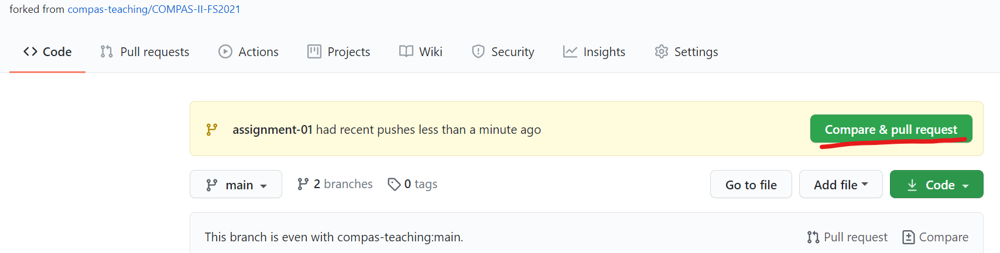

# Assignment 07

Create your own function that in some way modifies the output of COMPAS_SLICER. You can choose any model as a base for the modifications, also your own design. 

## Deliverables:
- Script you use to slice the geometry (.py)
- Script containing your own function (.py)
- Screenshot of the output (.jpg/.png)
- (Mesh file, only in case you use your own design, .stl/.obj)

Here are some images for inspiration:

Ronald Rael, Emerging Objects. 

Olivier van Herpt

## How to submit your assignment

1. Make sure you have forked this repository already, if not, check [assignment submission instructions in lecture 02](../../lecture_02/assignment_01#how-to-submit-your-assignment).
2. Make sure your local clone is up to date on the `main` branch

       (compas-fs2021) git checkout main
       (compas-fs2021) git pull origin

3. Use a branch called `assignment-06` for this week's assignment

       (compas-fs2021) git checkout -b assignment-07
       (compas-fs2021) git push -u assignments assignment-07

4. Create a folder with your name and last name, eg. `elvis_presley` (make sure it is inside the current assignment folder)
5. Work on the assignment into your folder.
6. Commit
    

<small>(How do I commit?)</small>

    

    Usually, commits are done from a visual client or VS code,
    but you can also commit your changes from the command line:

       (compas-fs2021) git add lecture_05/assignment_04/elvis_presley/\* && git commit -m "hello world"

    
    

    

8. Once you're ready to submit, push the changes:

       (compas-fs2021) git push assignments

9. And create a pull request (<small>[What's a pull request?](https://docs.github.com/en/github/collaborating-with-issues-and-pull-requests/about-pull-requests)</small>)

    1. Open your browser and go to your fork
    2. Create the pull request clicking `Compare & pull request` and follow the instructions

    
